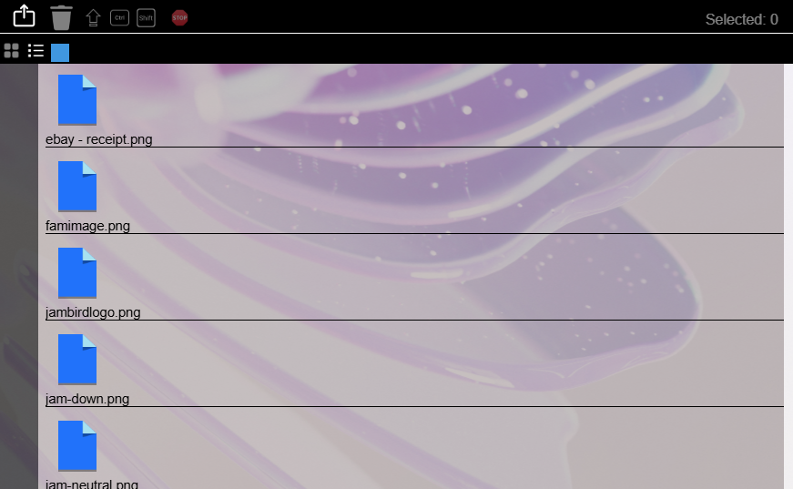

# Mock Filesystem

## About
A mock filesystem prototype that handles file uploads, file selection and error handling.

## features
1. Access on mobile or desktop devices (touch)
2. MacOS compatability - Command Key included for Mac users
3. Keyboard hot key compatability (Similar to File Explorer)

<em>Examples:</em>

Select multiple files from point A to point B

<b>(Click on point A, then Shift + left Click )</b>

 

Select multiple files in random order

<b>(Click on point A, then Ctrl/Command + left Click )</b>

 

Delete files

<b>(Delete / Del / Backspace)</b>

 

## Languages:
1. JavaScript
2. CSS
3. HTML

## Under Development
1. Image conversion
2. Folder recognition / uploading